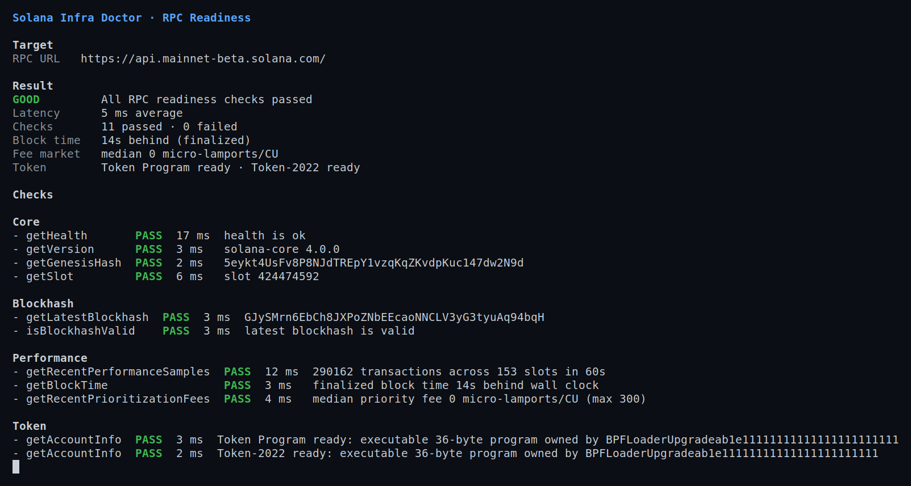
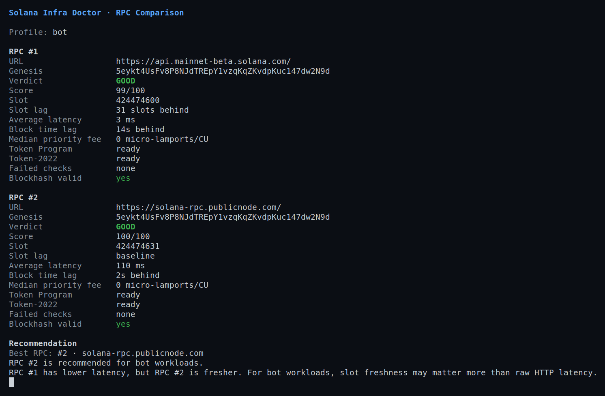
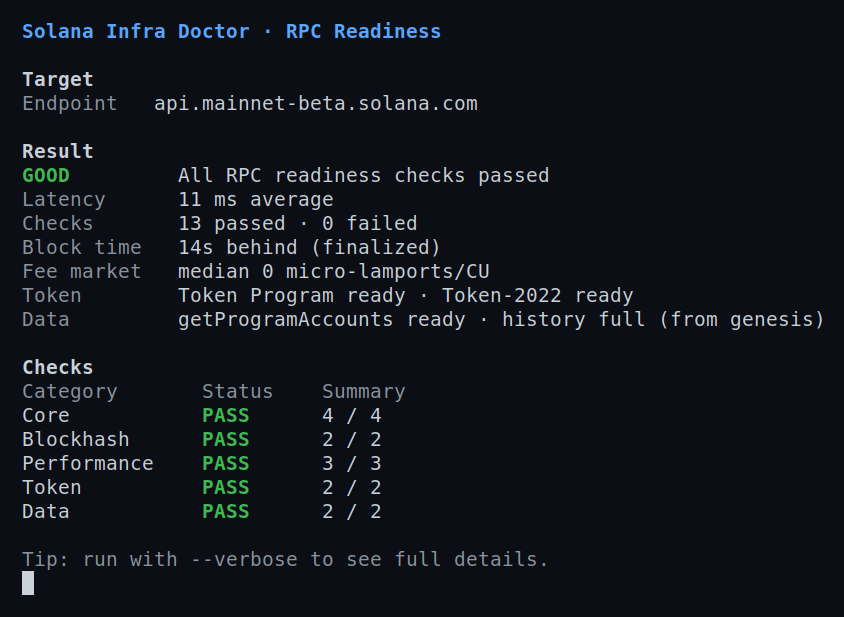
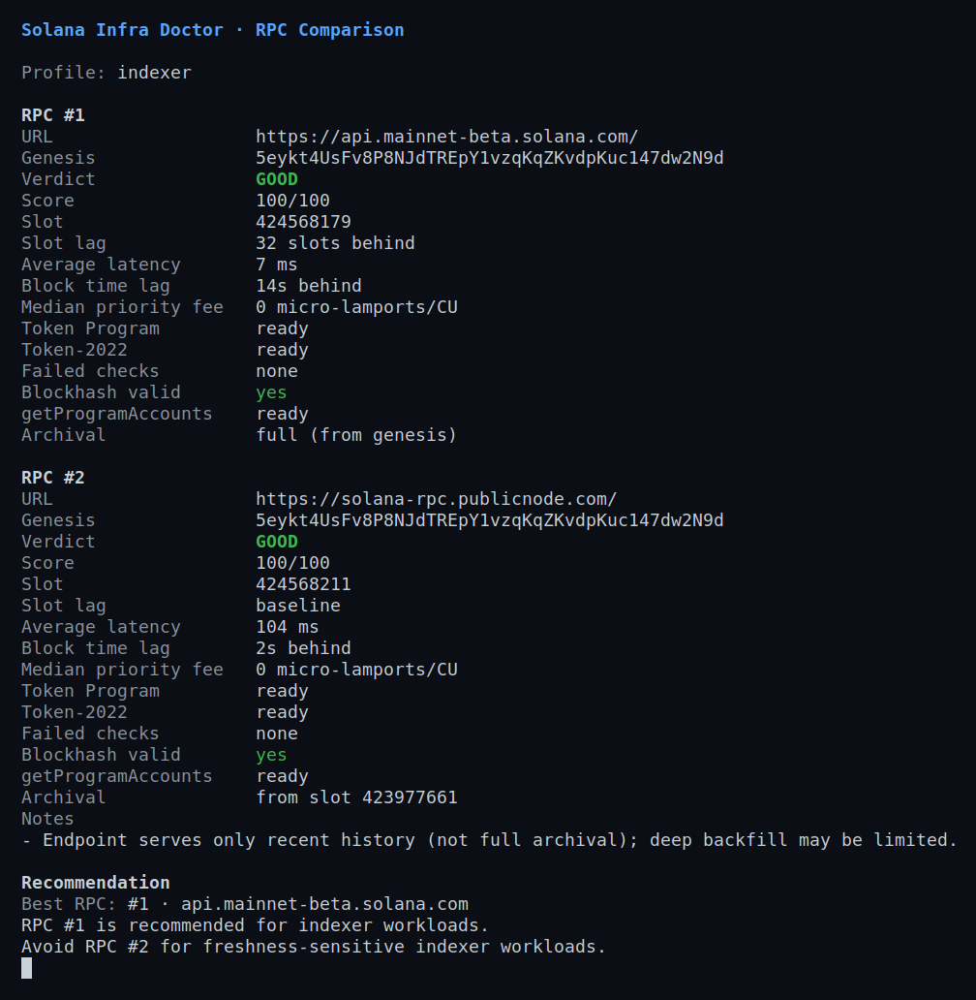
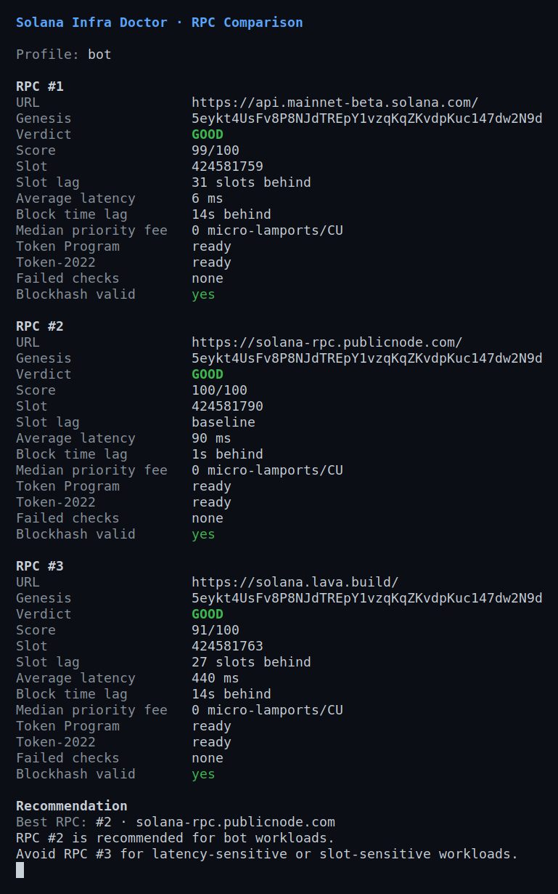
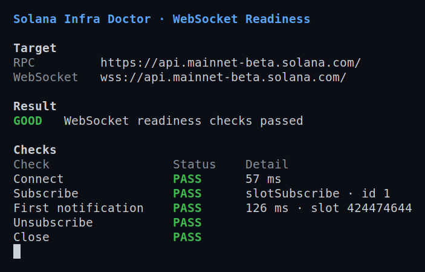
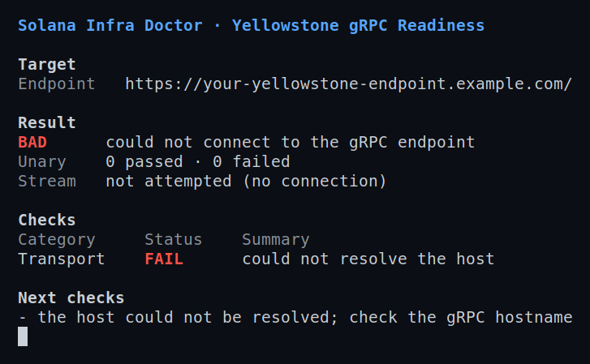
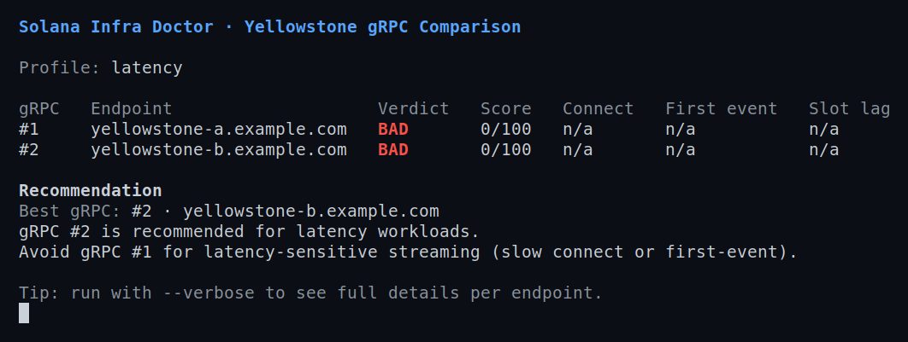

# Terminal Screenshots

Real-terminal captures of `sol-doctor`, rendered in an actual terminal emulator
(`xterm`) and screenshotted — not an ANSI-to-image renderer and not a mockup.
They are a companion to the text examples under [`examples/`](../examples/) and
to the renderer-based images in [`docs/images/cli/`](images/cli/).

The `check`, `compare`, and `ws` images are **real, live runs against public
Solana mainnet endpoints** (`api.mainnet-beta.solana.com`,
`solana-rpc.publicnode.com`). Latency, slot numbers, and timings are actual
measurements and vary by time, region, this host's network egress, and endpoint
conditions. Showing an endpoint is not a benchmark or an endorsement.

## `check` — single RPC readiness

`sol-doctor check --rpc https://api.mainnet-beta.solana.com --verbose`

## `compare` — multi-endpoint scoring (`bot` profile)

`sol-doctor compare --rpc … --rpc … --profile bot --verbose`

The lower-latency endpoint is not automatically the winner: the `bot` profile
weighs slot freshness, so the fresher endpoint can rank higher despite higher
HTTP latency.

## `check --data` — data-readiness (getProgramAccounts + archival)

`sol-doctor check --rpc https://api.mainnet-beta.solana.com --data`

Adds a **Data** category for indexer/data-pipeline workloads: whether
`getProgramAccounts` is enabled (probed on a small non-excluded program) and how
deep the endpoint's archival history goes. The Data line is informational and
does not by itself flip the verdict.

## `compare --data` — indexer data-readiness ranking

`sol-doctor compare --rpc … --rpc … --profile indexer --data --verbose`

The `indexer` profile scores `getProgramAccounts` enablement and archival depth,
so an endpoint that serves only recent history ranks lower for backfill-heavy
indexer workloads even when both are otherwise healthy.

## `compare` — three public providers (`bot` profile)

`sol-doctor compare --rpc … --rpc … --rpc … --profile bot --verbose`

A point-in-time run against three **public, no-auth** endpoints (Solana
Foundation, PublicNode, Lava). The lowest-latency endpoint is not the winner: for
`bot`, slot freshness outweighs raw latency. **Example output, not an authoritative
ranking** — latency and freshness vary by time, region, and load; re-run to
reproduce. The full report is in
[`examples/reports/rpc-comparison-multi-provider.md`](../examples/reports/rpc-comparison-multi-provider.md).

## `ws` — WebSocket realtime readiness

`sol-doctor ws --rpc https://api.mainnet-beta.solana.com --verbose`

## `grpc check` — Yellowstone gRPC (error-handling example)

`sol-doctor grpc check --grpc https://<endpoint> --verbose`

Unlike HTTP RPC, **Yellowstone gRPC has no stable public endpoint**: every
provider requires an `x-token` credential. A successful `grpc check` therefore
cannot be shown in a public repository without exposing a private endpoint and
token, which this project does not do.

This capture instead uses a reserved placeholder host
(`your-yellowstone-endpoint.example.com`, which does not resolve) to show how
the command **classifies a transport failure**, keeps the URL redaction-safe,
and prints an actionable next step — the same handling you would see for a
mistyped or unreachable gRPC host:

To run `grpc check` against a real endpoint, supply the `x-token` via an
environment variable (never on the command line); see the
[README](../README.md#yellowstone-grpc-readiness).

## `grpc compare` — ranking gRPC endpoints (output structure)

`sol-doctor grpc compare --grpc … --grpc … --profile latency`

For the same reason as `grpc check`, a *successful* `grpc compare` cannot be
shown publicly — ranking real endpoints needs private `x-token`s. This capture
uses non-resolving placeholder hosts to show the **output structure**: the
per-endpoint table (verdict, score, connect, time-to-first-event, slot lag), the
ranking, and the recommendation. Both endpoints are unreachable here, so both
score `0`; with real endpoints the table is populated and ranked:

Pair each endpoint's token by position with `--x-token-env` (read only from the
environment, never printed); see the
[README](../README.md#yellowstone-grpc-comparison).

## How these were generated

Refreshed **manually** (never in CI), the same way as the text examples: build
the release binary, then capture each command live with `--color always` so
color survives the non-TTY capture. Unlike the renderer-based images in
[`docs/images/cli/`](images/cli/) (which use `freeze`; see
[`readme-screenshots.md`](readme-screenshots.md)), these are captured from a real
terminal emulator:

1. Run a virtual X display: `Xvfb :99 -screen 0 1600x1100x24` (this host is
   headless), and paint the root the terminal background so the crop is precise:
   `xsetroot -solid '#0b0e14'`.
2. Run the command inside a real `xterm` pinned to an installed monospace family
   (`-fa 'DejaVu Sans Mono' -fs 14`) — the human output aligns columns with
   spaces, so a genuinely monospace font is required.
3. Screenshot the X display with `scrot`, then tight-crop with ImageMagick:
   `convert raw.png -fuzz 12% -trim +repage -bordercolor '#0b0e14' -border 22 out.png`.

Rules carried over from [`readme-screenshots.md`](readme-screenshots.md):
**public endpoints only** for live runs, **never** a private/credentialed
endpoint, and **no secrets** — the `grpc` image uses a non-resolving placeholder
host precisely so nothing needs to be redacted. `xterm`, `scrot`, `Xvfb`, and
ImageMagick are local documentation tooling only; none are runtime or build
dependencies of the crate, and nothing in the published crate depends on them.
The PNGs live under `docs/images/` which is excluded from the published crate
(see `exclude` in `Cargo.toml`) so they do not bloat the package.
